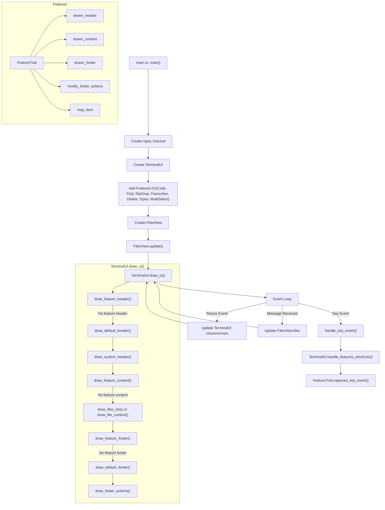

# Fishez Terminal File Manager - Flowchart

Two layouts are available:
- Default single pane uses one `FilesView` and `TerminalUI::draw_ui`.
- Two-pane mode is a runtime toggle (`Ctrl+T`); `--two-pane` / `-2` remain startup aliases for the same state.

## Responsiveness verification

- In a large directory, type a filter and repeatedly backspace. Matching uses the last directory snapshot; clearing the filter restores its entries without rereading disk. Reenter the directory to pick up external changes.
- Submit a RipGrep search across a large tree, then move the cursor or change directories. Input should remain responsive, and results from the old directory must not replace the new listing.
- Preview text with F3, including syntax-highlighted files. A loading view appears while the worker runs. Press Escape before completion; the preview must stay closed.
- Confirm deletion of disposable files, then navigate while the trash operation runs. The originating directory refreshes on completion if it is still open; errors appear as notifications.
- Hold an arrow key while browsing a slow mount. Footer counts come from the listing, and free space refreshes in a worker at five-second intervals, with at most one disk query in flight per pane.
- Copy many small files. Progress updates are throttled to 50 ms, queued messages are processed in bounded batches, and each batch redraws once. Verify cancellation and conflict prompts still respond.

Directory enumeration on entry/refresh remains synchronous. These changes remove repeated enumeration while filtering; they do not guarantee a latency bound when entering a slow filesystem.
